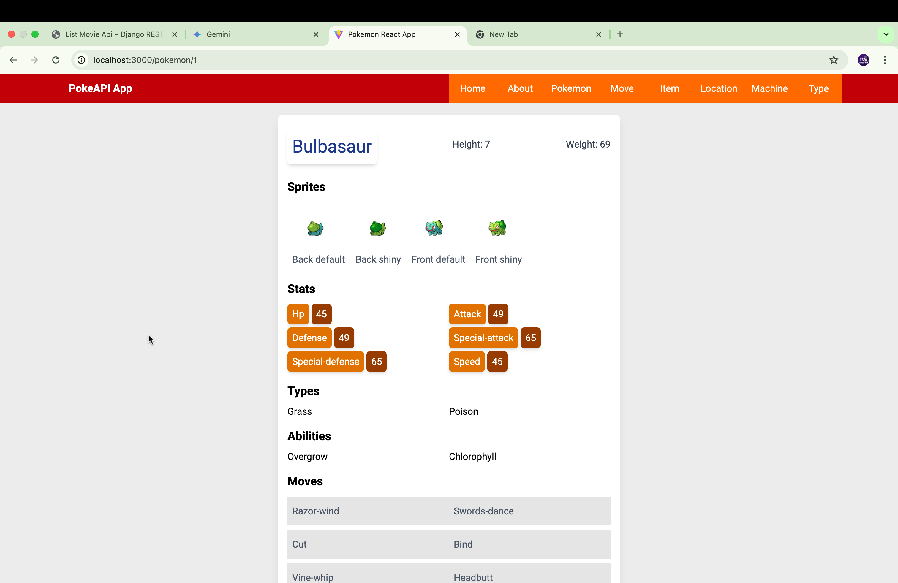
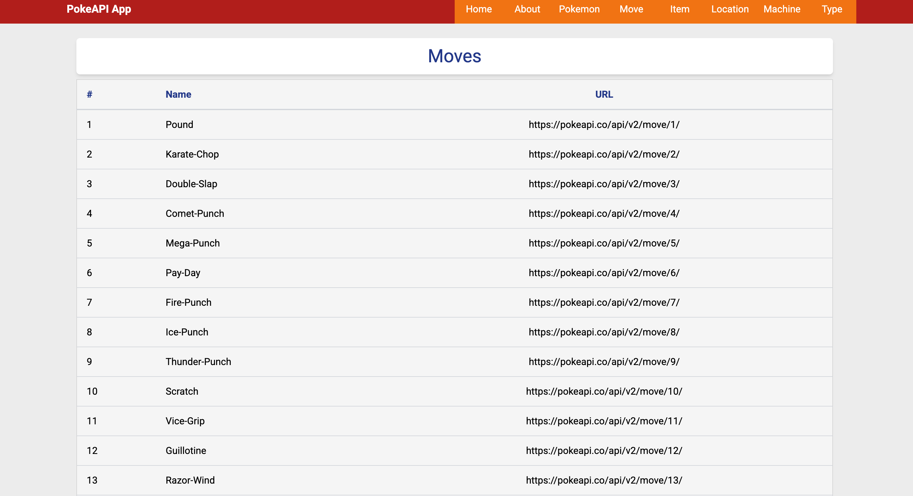
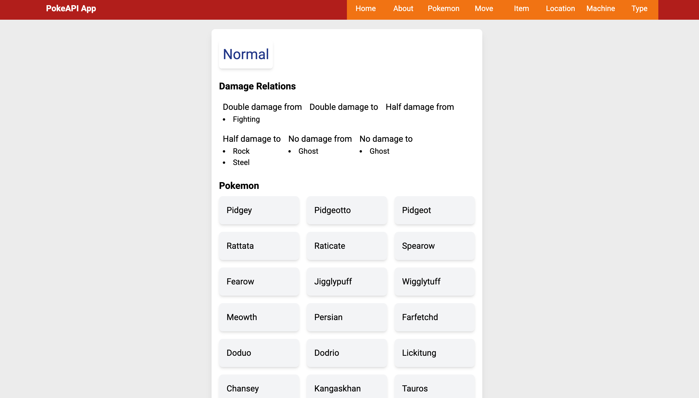
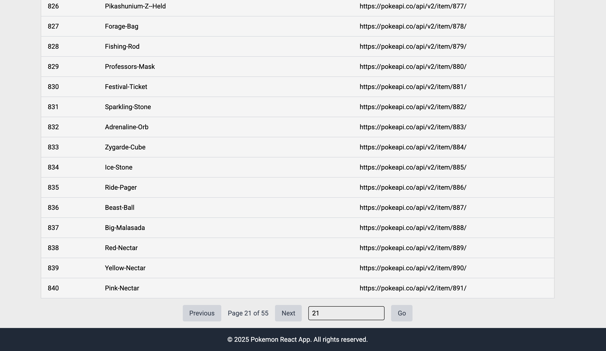
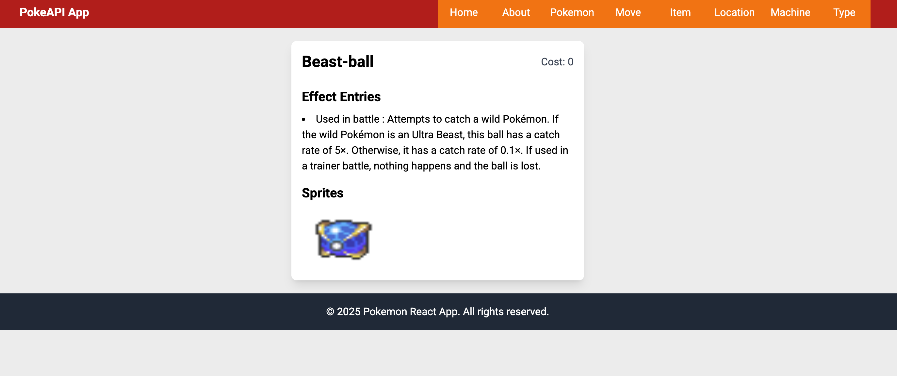

# React PokeAPI App


## About

This is a hobby application which utilizes the PokeAPI to fetch and display data about various Pokémon. The app is built using React for the frontend, Redux for state management, and TailwindCSS for styling. Redux Toolkit is used to simplify the Redux setup and improve code readability.

## Features

It includes following pages split into 6 modules 

- Pokemon
- Item
- Location
- Move
- Machine (TM and HM)

Individual detail pages for pokemon, item etc exist to get more insights into individual items from the API.

## Screenshots

Here are few screeshots of the application. The CSS is likely to change in future if theme colors are changed.

First screenshot shows the Pokemon detail page



This one shows moves page, similarly we have pokemon, items and other list pages as well.



Type detail page. It shows list of pokemon belonging to that type.



This shows pagination at the end of items page.



Item detail page screenshot.



## Installation

1. Clone the repository:
    ```sh
    git clone https://github.com/yourusername/react_pokeapi_app.git
    ```
2. Navigate to the project directory:
    ```sh
    cd react_pokeapi_app
    ```
3. Install dependencies:
    ```sh
    npm install
    ```

## Usage

1. Start the development server:
    ```sh
    npm run dev
    ```
2. Open your browser and go to `http://localhost:3000` to see the app in action.

## Contributing

Contributions are welcome! Please fork the repository and create a pull request with your changes.

## License

This project is licensed under the MIT License.
